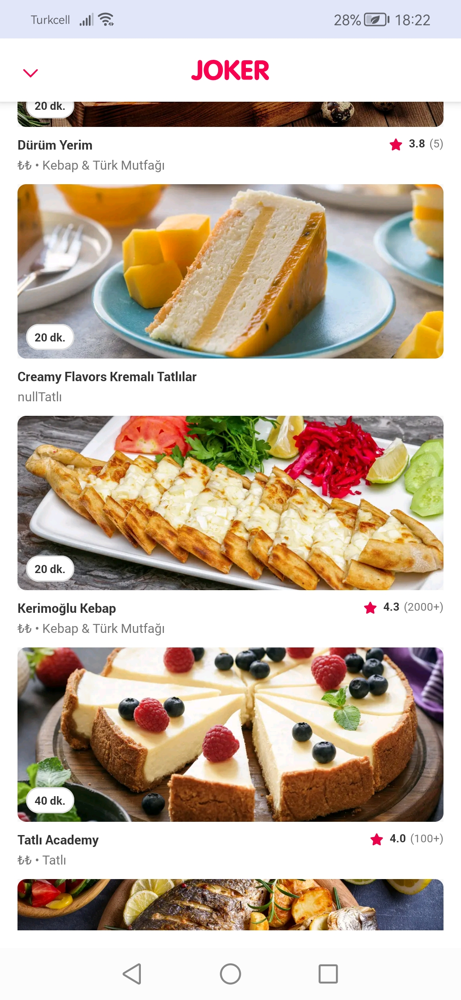
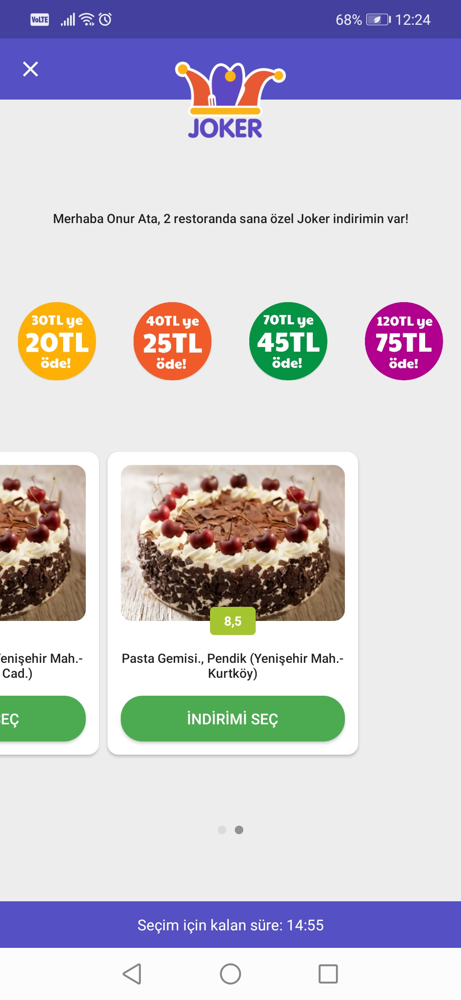
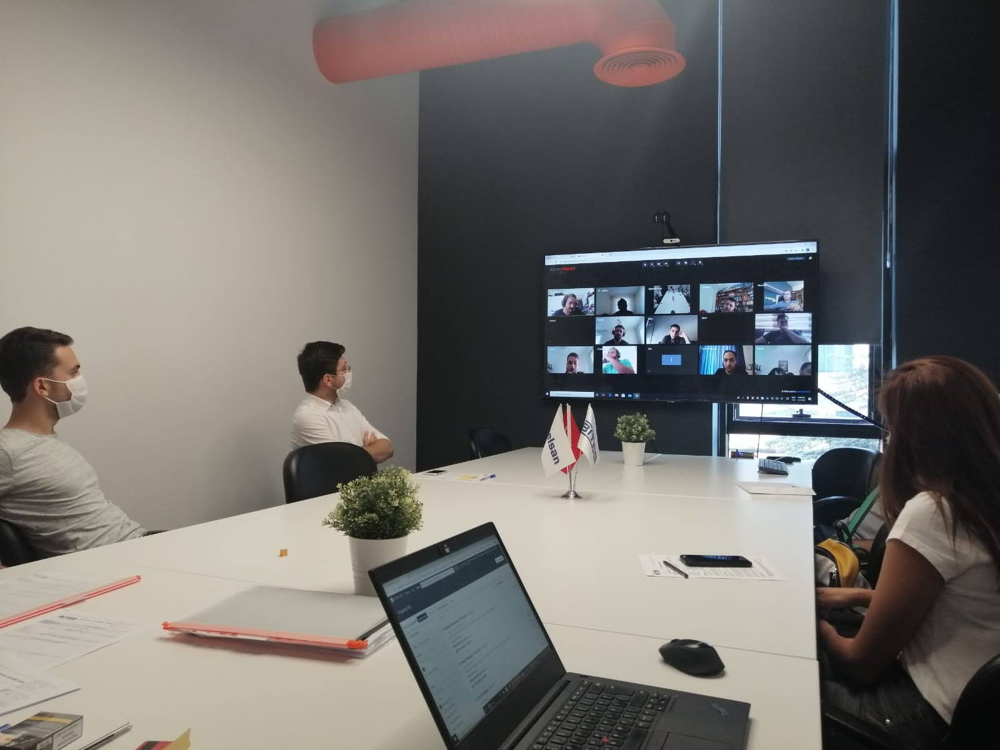
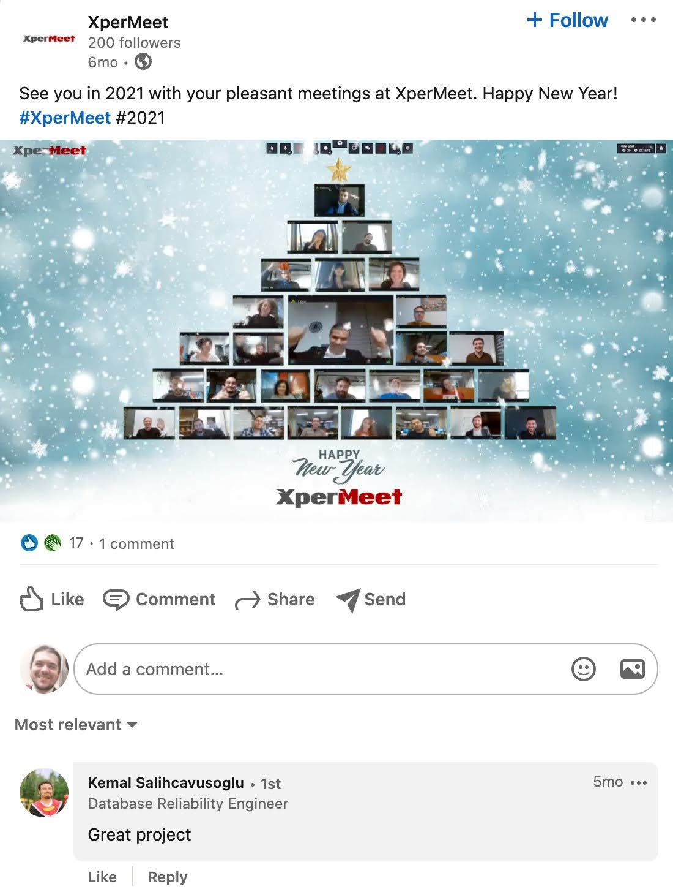

  

    <h3>Joker - Sponsored Deals
    2021-now</h3>

    
An AdTech & SaaS product built from scratch in Türkiye and scaled globally as “Global Joker,” now serving 50+ markets under localized brand names (Yemeksepeti, Talabat, Foodpanda, PedidosYa).

    <ul>
      <li>Built backend APIs in Golang, .NET, and Python handling high-throughput AdTech and user behavior data.</li>
      <li>Led backend rewrite for Joker’s core service in Golang on GKE, reducing p99 latency by 70%.</li>
      <li>Contributed to frontend components using React and Angular. Launched in-house A/B Testing SDK with tracking and event validation logic, increasing revenue 87% YoY.</li>
      <li>Collaborated cross-functionally with engineering, data science, design, and regional teams to align product strategy with business goals and ensure smooth adoption at scale.</li>
    </ul>
  

  

    
    
  

<h3>shmup (Shoot 'Em Up)
2025</h3>
    
Retro-style shooter game developed in PICO-8 fantasy console, featuring classic arcade gameplay.

    <ul>
      <li>Built using PICO-8's constraints (128x128 resolution, 16 colors, 32KB code limit).</li>
      <li>Implemented enemy AI, bullet patterns, and scoring system.</li>
      <li>Created pixel art sprites and sound effects within platform limitations.</li>
    </ul>
    
<strong>Tech Stack:</strong> PICO-8, Lua

    
<a href="https://github.com/ata-o/shmup" target="_blank">View on GitHub</a>

<h3>Web API Portfolio
2019-2025</h3>
    
Collection of REST APIs built for technical assessments and take-home assignments, demonstrating various architectural patterns and technologies.

    <ul>
      <li>Multiple projects showcasing different backend frameworks and design patterns.</li>
      <li>Implementations include authentication systems, CRUD operations, data processing pipelines, and more.</li>
      <li>Containerized applications with Docker for easy deployment and testing.</li>
      <li>Full-stack examples combining backend APIs with React/TypeScript frontends.</li>
    </ul>
    
<strong>Tech Stack:</strong> Python, Node.js, .NET, Golang, React, TypeScript, Docker

    
Employee HR Profile, Flask + React: <a href="https://github.com/ata-o/employee">View on GitHub</a>

    
KrakenClient, Node.js + Typescript: <a href="https://github.com/ata-o/krakenclient">View on GitHub</a>

    
Creosafe, Node.js + React + Graphql: <a href="https://github.com/ata-o/safe-app">View on GitHub</a>

<h3>Xper- Product Suite
2019-2021</h3>
    
Microservice-based enterprise SaaS platform developed at BITES, including multiple products: XperLMS (SCORM-compliant learning management system), XperPay (payment gateway integrated with Iyzico), and XperDrive (end-to-end encrypted file management system).

    <ul>
      <li>Designed and implemented microservice architectures across multiple products.</li>
      <li>Built backend services handling authentication, storage, payments, and real-time communications.</li>
      <li>Owned end-to-end development of BizBize’s core video conferencing service, handling real-time video/audio streaming, screen sharing, and chat functionalities using WebRTC.</li>
      <li>Made POCs and implemented features like webinars, whiteboarding, secure file sharing, and encrypted meeting modes.</li>
      <li>50K concurrent users during peak usage, adopted by various government agencies and enterprises for secure communications.</li>
      <li>Developed frontend components for admin panels and user interfaces.</li>
    </ul>
    
<strong>Tech Stack:</strong> .NET Core 3.1, Django, PostgreSQL, RabbitMQ, Vue.js, Docker, AWS, gRPC

    

    
    
  

<h3>Aircraft Detection AI
2020</h3>
    
Computer vision system for automated aircraft detection and cataloging from aerodrome surveillance imagery, developed for defense sector applications.

    <ul>
      <li>Trained and fine-tuned YOLOv3 model on custom aircraft dataset for real-time detection.</li>
      <li>Implemented detection pipeline for processing surveillance footage and generating automated catalogues.</li>
      <li>Achieved production-ready accuracy for multiple aircraft types and classifications.</li>
    </ul>
    
<strong>Tech Stack:</strong> Python, TensorFlow, YOLOv3, COCO Dataset

<h3>Supplier Decision Support System - ASELSAN
2020-2021</h3>
    
Enterprise supplier management platform for defense industry supply chain optimization, handling evaluation, scoring, and analytics for thousands of suppliers.

    <ul>
      <li>Developed full-stack application with Django REST API backend and Vue.js frontend.</li>
      <li>Integrated financial data processing and decision-making algorithms for supplier evaluation.</li>
      <li>Implemented asynchronous task processing with RabbitMQ for large-scale data operations.</li>
      <li>Deployed on PostgreSQL with high-availability configuration for mission-critical operations.</li>
    </ul>
    
<strong>Tech Stack:</strong> Django, RabbitMQ, Vue.js, PostgreSQL

<h3>War Room VR Simulator
2019-2021</h3>
    
Immersive virtual presence sandbox for military professionals supporting collaborative operations planning on Oculus Rift S and Quest.

    <ul>
      <li>Solo developer - built complete VR application from concept to deployment.</li>
      <li>Implemented custom water and cloud shaders optimized for mobile VR (Android) using optical phenomena research papers.</li>
      <li>Integrated SWORD simulation system (MASA) via gRPC for real-time tactical data visualization.</li>
      <li>Delivered fully functional product independently within aggressive timeline.</li>
    </ul>
    
<strong>Tech Stack:</strong> Unity, Oculus SDK, HLSL/Cg, gRPC, SWORD (MASA)

<h3>Riders on the Storm - Ride-Sharing Mobile Application
2018-2019</h3>
    
Full-stack Uber/Lyft clone built from scratch as senior project, featuring real-time ride matching, GPS tracking, and payment processing.

    <ul>
      <li>Designed and developed complete application including REST API server, mobile frontend, and automated testing suite.</li>
      <li>Implemented real-time location tracking, ride request matching, and driver-rider communication.</li>
      <li>Built payment processing system and ride history management.</li>
      <li>Comprehensive test coverage using Mocha for API endpoints and business logic.</li>
    </ul>
    
<strong>Tech Stack:</strong> Node.js, React Native, Mocha

    
<a href="https://github.com/ata-o/riders-on-the-storm" target="_blank">View on GitHub</a>

<h3>Museum Corvus - a Virtual Cultural Heritage Museum
2018-2019</h3>
    
Immersive 3D museum experience showcasing Turkish cultural heritage. Awarded TÜBİTAK 2209-B Research Grant in 2019.

    <ul>
      <li>Collaborated with team of three in deadline-driven environment using JIRA for project management.</li>
      <li>Implemented interactive exhibits, navigation systems, and historical information displays.</li>
      <li>Used Git for version control and code collaboration.</li>
      <li>Received national research grant for project quality and cultural impact.</li>
    </ul>
    
<strong>Tech Stack:</strong> Unity3D, C#, JIRA, Git

    
<a href="https://github.com/ata-o/museumcorvus" target="_blank">View on GitHub</a>

<h2>Personal Projects</h2>

<h3>move-the-fan - a hyper casual mobile game
2019</h3>
    
Mobile game developed during job search period, featuring simple mechanics and addictive gameplay loop.

    <ul>
      <li>Solo developer - full game design, development, and asset creation.</li>
      <li>Implemented core gameplay mechanics, UI/UX, and progression systems.</li>
      <li>Optimized for mobile performance and battery efficiency.</li>
    </ul>
    
<strong>Tech Stack:</strong> Unity, C#

    
<a href="https://github.com/ata-o/Move-The-Fan" target="_blank">View on GitHub</a>

<h3>silivribot - a Discord Bot for checking weather
2020</h3>
    
Real-time weather checking bot for Discord servers, providing current weather information and forecasts.

    <ul>
      <li>Prints out real-time weather data for requested locations.</li>
      <li>Integrated with weather API for accurate and up-to-date information.</li>
      <li>Supports multiple commands and location formats.</li>
    </ul>
    
<strong>Tech Stack:</strong> [Python/Node.js]

    
<a href="https://github.com/ata-o/silivribot" target="_blank">View on GitHub</a>

